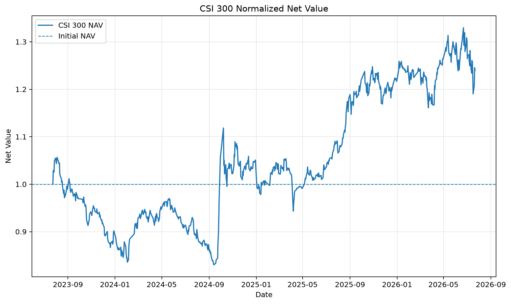

# 沪深300收益率、净值与极端行情分析

[](https://github.com/lpwei-quant/quant-research-2026/actions/workflows/ci.yml)

基于沪深300价格指数（000300）2023-07-24至2026-07-22的726个交易日数据，构建一条可复现的分析流程：数据获取与质量检查、收益率计算、双路径净值校验、极端交易日识别和事件窗口归因。



## 核心发现

- 样本期累计收益约 **+23.97%**，期末标准化净值为1.2397，年化收益约7.4%。
- 2024-09-24至2024-10-08的 **6个交易日** 累计上涨约32.5%，超过完整样本期总回报。
- 最大单日跌幅为-7.05%（2024-10-09），紧随前一阶段快速上涨，属于同一极端行情窗口。
- 2024-10-08收盘收益率为+5.93%，但从当日开盘持有至收盘约亏损4.37%，说明收盘到收盘收益率无法代表日内可实现收益。
- 简单收益率连乘与对数收益率累加两条路径得到的净值序列通过 `numpy.allclose` 交叉验证。

## 快速复现

```bash
git clone https://github.com/lpwei-quant/quant-research-2026.git
cd quant-research-2026

python -m venv .venv

# Windows PowerShell
.\.venv\Scripts\Activate.ps1

# macOS / Linux
source .venv/bin/activate

pip install -r requirements.txt
python fetch_csi300.py
python inspect_csi300.py
python src/day02_return_analysis.py
python src/m02_extreme_days.py
```

原始数据由AkShare接口获取，保存在本地 `data/` 目录中；该目录不纳入版本控制。分析脚本会生成净值曲线、指标摘要和极端行情明细。

## 项目结构

```text
quant-research-2026/
├── fetch_csi300.py                  # 获取沪深300日行情
├── inspect_csi300.py                # 字段、缺失、重复和日期范围检查
├── src/
│   ├── day02_return_analysis.py     # 收益率、净值、年化收益和回撤
│   └── m02_extreme_days.py          # 极端交易日与事件窗口分析
├── tests/
│   └── test_analysis.py             # 核心计算与数据质量回归测试
├── .github/workflows/
│   └── ci.yml                       # GitHub Actions 自动检查
├── output/
│   └── figures/
│       └── csi300_nav_curve.png
├── notes/
│   └── commands.md                  # 项目命令速查
├── requirements.txt
└── README.md
```

## 方法与校验

设收盘价为 $P_t$：

- 简单收益率：$R_t=P_t/P_{t-1}-1$
- 对数收益率：$r_t=\ln(1+R_t)$
- 简单收益率净值：$NAV_T=\prod_{t=1}^{T}(1+R_t)$
- 对数收益率净值：$NAV_T=\exp(\sum_{t=1}^{T}r_t)$

分析流程包含以下检查：

1. 验证必需字段、日期唯一性、时间顺序和缺失值。
2. 分别通过简单收益率和对数收益率构造净值并交叉验证。
3. 输出累计收益、年化收益、年化波动率和最大回撤。
4. 保存最大涨跌交易日及2024年9月至10月事件窗口明细。

## 自动化测试

```bash
python -m unittest discover -s tests -v
```

测试使用合成行情，不依赖外部数据接口，覆盖数据质量校验、简单收益率与对数收益率净值交叉验证，以及事件窗口计算和结果文件生成。GitHub Actions会在每次提交和拉取请求时自动执行这些检查。

## 局限

- 使用价格指数而非全收益指数，不包含股息再投资，因此低估长期持有回报。
- 收盘到收盘收益率不反映日内交易路径，极端行情下与实际可实现收益可能明显不同。
- 本项目用于数据处理和研究方法展示，不构成投资建议。

